# Architecture

This document records the system boundaries and decisions behind Muse Glimmer Playground. The [README](README.md) is the operator guide; this file owns implementation details, state semantics, tradeoffs, and maintenance invariants.

## Goals and boundaries

The project is a single-user, local-first playground for Muse Glimmer 30B on a high-memory Apple silicon Mac. Its primary goals are fast Metal inference, true text-and-reasoning streaming, vision input, warm multi-turn chat, a conventional chat interface, and a repeatable double-click launch.

The following are deliberate boundaries:

- The supported runtime is ExecuTorch with MLX/Metal. There is no CPU fallback.
- The server is a foreground loopback process, not a daemon or remotely hosted service.
- One model worker owns one resident weight load and serializes generations.
- The browser holds one active transcript. It does not persist conversations or maintain branches.
- The browser does not expose Muse Glimmer's ATEM tool-calling interface, although the server adapter retains upstream tool parsing for API callers.
- Generated dependencies, model data, and native builds are not committed.

## System overview

```mermaid
flowchart LR
    Browser["React browser app"] -->|"HTTP and SSE"| API["FastAPI composition root"]
    API --> Adapter["Muse chat and Harmony stream adapter"]
    Adapter --> Runtime["ExecuTorch SessionRuntime"]
    Runtime -->|"JSONL over stdin and stdout"| Worker["Persistent native worker"]
    Worker --> Model["K-Quant target, DFlash draft, and vision encoder"]
    Model --> Metal["MLX and Metal on the Apple GPU"]
```



The browser and API use one origin. FastAPI registers API routes first and mounts the production React build at `/`, avoiding a second web server and any CORS configuration. The native worker is a subprocess rather than a Python extension, keeping HTTP concerns and blocking model execution on opposite sides of a small JSONL boundary.

## Components and ownership

| Area                    | Primary files                                                     | Responsibility                                                                                                                                                                      |
| ----------------------- | ----------------------------------------------------------------- | ----------------------------------------------------------------------------------------------------------------------------------------------------------------------------------- |
| Launch                  | `setup.sh`, `scripts/launch.sh`, generated `Muse Glimmer.command` | Generate the local Finder launcher, detect an existing instance or port conflict, hold the launch lock, prevent sleep, start the foreground server, and open the browser when ready |
| Bootstrap               | `scripts/bootstrap.sh`, `scripts/runtime-config.sh`               | Validate the Mac toolchain, prepare local dependencies, fetch pinned sources and artifacts, apply the native patch, build the worker and frontend, and reuse valid outputs          |
| Browser shell           | `app/routes/_index.jsx`                                           | Own the in-memory conversation, editing, generation lifecycle, responsive layout, and runtime status                                                                                |
| Browser protocol client | `app/lib/chat-api.js`                                             | Build OpenAI-shaped requests, manage session operations, and parse arbitrary SSE chunk boundaries into reasoning, content, usage, and runtime metrics                               |
| Browser presentation    | `app/components/chat/*`                                           | Render Markdown, inline editors, thinking disclosure, message actions, and playground settings                                                                                      |
| Server composition      | `server/app.py`                                                   | Validate required assets, construct the upstream template/runtime/server pieces, add local endpoints and runtime metadata, serve static assets, and close the worker at shutdown    |
| Muse adapter            | `server/muse_streaming.py`                                        | Demultiplex Harmony reasoning and visible content during generation, preserve exact warm-resume transcripts, and append worker metrics to the stream                                |
| Upstream runtime        | `.runtime/src/executorch/`                                        | Provide OpenAI request validation, chat templating, session admission, transcript bookkeeping, worker protocol, model execution, and MLX integration                                |
| Native fixes            | `patches/executorch-muse-cancel.patch`                            | Add targeted cooperative cancellation and bind vision execution to the correct mutable MLX session                                                                                  |

`.runtime/` is generated and ignored. Application behavior that this project owns remains in tracked browser/server files or the narrow tracked patch rather than being edited manually in the generated checkout.

## Turn lifecycle

A normal generation follows this sequence:

1. The browser snapshots the visible transcript, system message, attachment, and generation settings. UI-only reasoning, status, error, and metrics fields are omitted from OpenAI history.
2. An image, if present, is represented as an inline JPEG or PNG data URL in an OpenAI `image_url` content part.
3. FastAPI and the upstream protocol models validate the request before streaming begins. A named session is admitted before response bytes are sent so capacity errors remain ordinary HTTP errors.
4. The Muse adapter validates and extracts the image, renders the official Harmony chat template, and asks the transcript store to splice exact token IDs for matching prior assistant turns.
5. `SessionRuntime` queues the request behind any active operation and drives the blocking worker from its single executor thread.
6. The worker selects the named session, optionally encodes and stages the image, prefills only the non-resident prompt suffix when possible, and performs DFlash decoding.
7. The custom Harmony parser incrementally routes `to=self` bodies to `reasoning_content` and the user-addressed body to `content`, holding only possible partial control-token suffixes between chunks.
8. The server emits the terminal finish chunk, a project metrics frame, optional usage, and `[DONE]`. The browser updates the assistant message throughout the stream.
9. The server records the full generated token IDs and a fingerprint of the returned visible assistant payload. Those IDs include the original Harmony structure and reasoning even though browser history contains only visible response text.

This split is important: re-rendering an assistant answer from visible text is not token-identical to what Muse generated. Preserving the original token IDs enables exact prefix reuse without putting thinking into the next API request.

## Conversation and editing semantics

The browser message model keeps display concerns separate from model-visible history. An assistant message can own visible text, reasoning text, status, error details, and metrics; only its visible text becomes a subsequent `assistant` message. A user message can additionally own an image. System instructions and sampling settings are request-level state, not transcript messages.

Any user or assistant text can be edited inline. Saving a historical edit has intentionally linear semantics:

1. Reset the resident server session and its exact-token transcript.
2. Commit the edited text only after that reset succeeds.
3. Remove every descendant turn because this version has no branch graph.
4. For a user edit, immediately generate a new assistant response from the retained prefix and edited prompt.
5. For an assistant edit, save the text locally and wait for the next user prompt. The edited response then becomes visible model context.

Editing an assistant response also clears its old reasoning and performance metrics because neither describes the replacement text. Canceling the inline editor leaves the transcript and server session unchanged.

Reset-before-commit is an atomicity rule, not merely an optimization. It prevents the UI from presenting edited history while the worker still holds state for a different token sequence. The next generation after an edit performs the necessary prefill from canonical browser history.

Truncating descendants matches the interaction model used by linear chat products and keeps the state model small. The tradeoff is that an edit destroys the visible suffix rather than preserving alternate branches.

## Reasoning and Harmony streaming

Muse Glimmer can emit multiple addressed Harmony messages in one assistant turn. The model uses `to=self` for thinking and another recipient, normally `to=user`, for the final response. Harmony headers and delimiters may be divided across arbitrary native token chunks, so substring replacement on individual chunks would either leak control text or drop user content.

`server/muse_streaming.py` therefore uses an incremental state machine with header and body states. It buffers incomplete markers, recognizes the recipient at `<|message|>`, and emits body text through separate reasoning and answer channels. Plain non-Harmony output has a conservative end-of-stream fallback rather than disappearing.

The wire representation follows the upstream OpenAI-shaped extension:

- Thinking is streamed in `choices[0].delta.reasoning_content`.
- The final answer is streamed in `choices[0].delta.content`.
- Reasoning remains a display-only assistant field and is never echoed into `messages` on a later request.

The disclosure opens while reasoning arrives. It collapses when the first answer content arrives and remains available for manual inspection afterward. This mirrors the common chat pattern of showing active work without allowing a completed answer's reasoning to dominate the transcript.

Tool-bearing requests take the upstream buffered parsing path because a tool call must be validated as a complete structure before it can be returned. The browser does not currently send tools, so ordinary playground turns retain live dual-channel streaming.

## Sessions and warm resume

The launcher uses `max_sessions=2`. ExecuTorch reserves one physical session for anonymous scratch requests, leaving one addressable named session for the browser. The browser stores a printable UUID-like `session_id` in `localStorage`; it is an affinity identifier, not a conversation database or credential.

For each named session, two layers cooperate:

- The native worker owns mutable model state, resident prompt token IDs, and the authoritative exact-prefix check.
- The Python transcript store owns assistant fingerprints and the exact token IDs generated for prior turns.

On a later request, matching assistant turns are replaced with sentinels during template rendering and then spliced back as token-ID segments. The Muse-specific transcript subclass removes the rendered assistant recipient scaffold before the splice, because that scaffold is already present in Muse's generated IDs. If a fingerprint differs, the stale stored suffix is discarded. The worker's own prefix comparison is the final safety backstop and resets/refills instead of reusing incompatible state.

An edit resets every resident ID, but it may retain earlier assistant messages in browser history. The transcript subclass seeds those retained ordinals with fingerprinted, text-only placeholders before the first post-edit generation. The new generated assistant is therefore recorded at its true ordinal, allowing exact-ID warm reuse to resume on the following turn without ever treating edited text as model-generated IDs.

This makes ordinary append-only chat warm while keeping edits, regeneration, reused session IDs, and page reloads correct. A reload retains the session ID but loses browser history; the next short prompt will fail the resident-prefix match and cause a safe reset rather than inheriting hidden context.

New Chat closes the named session, freeing its slot, and creates a new identifier. If closing fails but the worker remains reachable, the browser falls back to resetting the existing slot. Reset and close clear worker state before their matching Python transcript records, so the two layers do not drift on a failed native operation.

## Model and runtime choices

The runtime is pinned to ExecuTorch commit `52b176fd9d5d5252f5010e60f17adfea83e8433d` and model repository revision `b0376783689fb024c95b43a063552f938c678ec2`. The selected artifact is:

```text
muse-glimmer-k-quant-17G-128K-text-image-dflash-metal.pte
```

It combines the 17G K-Quant target, DFlash draft, 128K context, vision encoder, and Metal methods in one PTE. The model file is 21,055,028,608 bytes; the separate precomputed vision position table is 6,291,456 bytes.

Runtime parameters are chosen for the upstream speed-oriented M5 Max path:

- DFlash block length: `4`
- Draft candidates per iteration: `3`
- Draft proposal selection: deterministic argmax
- Target sampling defaults: temperature `1.0`, Top P `0.95`, Top K `64`
- Context length: `131072`
- Native workers: `1`

DFlash reduces expensive target-model decode work while preserving the target sampling path. The published upstream reference for this artifact class was 50.2 output tokens/s with DFlash versus 26.6 without it. These are reference measurements, not service guarantees; prompt length, acceptance rate, thermals, OS/runtime versions, and other GPU work affect observed throughput.

One persistent worker avoids reloading or duplicating approximately 21 GB of weights. The cost is head-of-line blocking: HTTP requests may arrive concurrently, but generation and session operations queue behind the single model execution lock. A second worker was rejected because its extra concurrency would require a second resident weight load and substantially more unified memory.

The Metal-only artifact and M5 Max tuning keep the supported path simple and fast. They also mean the project does not degrade to CPU or promise useful behavior on smaller-memory Macs.

## Vision path

The browser permits one image per conversation because the Muse adapter accepts one image across the full request transcript. Each later turn resends that transcript, including the original image.

The browser checks MIME type and advertised size before reading the image. The server then independently requires an exact OpenAI image-part shape, a base64 JPEG or PNG data URL, valid base64, and a decoded size no larger than 20 MB. It replaces the image with a temporary template marker and then converts that marker into a worker prompt segment so image position is preserved. Native decoding and vision preprocessing perform the authoritative format and dimension validation.

Vision encoder time is reported separately from text prefill. The UI includes it in time to first generated token (TTFT) for multimodal turns.

## Native patch rationale

Muse support was new at the pinned upstream revision. The tracked patch closes two narrow runtime gaps without maintaining a broad fork.

### Cooperative cancellation

The upstream JSONL request holds the Python worker client's main lock while synchronously reading generation output, and its original `stop()` was a no-op. The patch adds:

- A dedicated write lock so a control line can be sent while generation owns the read lock.
- A generation-state lock and active session ID so cancellation can target only the request that is currently decoding.
- An out-of-band `{"op":"cancel"}` message.
- Nonblocking stdin polling in the native decode loop, followed by `session.stop()`.
- Safe consumption of a cancellation line that races with a terminal generation event.

The poll occurs at native decode iterations, which are DFlash speculative boundaries for this artifact. Cancellation therefore does not interrupt model loading, prompt prefill, vision encoding, or a currently executing decode call. If the targeted session is idle or different, the API returns `cancelled: false`; a stale request cannot cancel a future turn.

### Multi-session vision binding

The PTE exposes mutable MLX state that must be rebound to the active session. At the pinned revision, text generation performed that binding but the shared vision encoder did not, so image input could execute against the wrong mutable state in multi-session mode.

The patch exposes each multimodal session's mutable-state token, passes it into image preparation, and executes `vision_encoder` inside `with_active_session(...)` while retaining the existing vision execution mutex. Both autoregressive and DFlash session implementations provide the token.

### Project-owned Python adaptations

Two related fixes are clearer as tracked Python code rather than native patch hunks:

- Incremental Harmony channel parsing provides safe live reasoning and answer streams instead of buffering the whole turn.
- Muse-specific assistant-scaffold normalization makes exact generated-token splicing match the worker's resident prefix.
- Completion-budget normalization counts the rendered prompt and clamps a valid model-sized output cap to the exact remaining context. A prompt that fills the window or a cap larger than the model window still returns a structured `400` error.

The bootstrap patch and build stamps include both the ExecuTorch commit and patch hash. Changing either input reapplies the patch and forces a native rebuild; an unchanged pinned checkout and patch can reuse the worker.

## Concurrency and cancellation

`SessionRuntime` has one `asyncio.Lock` and one executor thread. Generation holds the lock through the entire native response, and open/reset/close operations use the same lock. This guarantees that the synchronous JSONL protocol is never driven by two ordinary operations at once.

Cancellation is the intentional exception. It uses the patch's separate write and state locks to send the out-of-band control line without waiting behind generation. The browser first requests targeted server-side cancellation; aborting its fetch is a fallback when no active native generation was found. If an async stream itself is canceled, the upstream runtime also stops and drains the worker before releasing the lock.

The server does not automatically spawn a replacement after a worker crash. Restarting the foreground launcher is the recovery boundary because it revalidates the generated runtime before loading the model again.

## HTTP and streaming contract

The API is OpenAI-shaped but not a claim of complete OpenAI compatibility. Unsupported parameters are rejected rather than silently ignored. `session_id`, session lifecycle routes, and cancellation are ExecuTorch/project extensions.

A streaming response can contain, in order:

1. An assistant role chunk.
2. Zero or more `reasoning_content` deltas.
3. Zero or more `content` deltas.
4. A finish-reason chunk.
5. A JSON data frame with a top-level `muse_metrics` object.
6. An optional OpenAI usage chunk when `stream_options.include_usage` is true.
7. `data: [DONE]`.

`muse_metrics` is a JSON payload in an ordinary SSE `data:` frame, not a named SSE `event:`. It reports native prefill/decode durations and rates, prompt tokens reused or prefetched, tokenizer-counted thinking tokens, session reset reason, total model time, and optional vision encoder time. Browser wall-clock duration is retained separately because it includes HTTP and presentation overhead.

Thinking is returned only when `chat_template_kwargs.return_reasoning` is true. The four-stop UI maps Low, Medium, High, and XHigh directly to `chat_template_kwargs.reasoning_strength`, defaulting to High. The browser enables reasoning return while keeping it out of subsequent message history. Its output ceiling defaults to the full 131,072-token context, and the adapter clamps each request to the space left after the rendered prompt.

The client parser accepts CRLF or LF framing, multiple `data:` lines, and JSON split across arbitrary network chunks. Midstream server failures are represented as structured error frames followed by `[DONE]` rather than an unexplained socket close.

## Bootstrap, containment, and repeatability

The launcher keeps the server in the foreground so Terminal owns its lifetime. It checks `/api/runtime` for the expected model before reusing an existing process, rejects a foreign process on port 3939, holds a recoverable launch lock, uses `caffeinate` while active, and opens the browser only after model readiness.

Bootstrap performs these stages idempotently:

1. Validate macOS, Apple silicon, Xcode, Node, npm, and the Metal compiler.
2. Download a checksum-verified, pinned `uv` and install Python 3.12 under `.runtime/`.
3. Create the local virtual environment and install server/build packages.
4. Fetch the pinned ExecuTorch commit and shallow recursive submodules.
5. Apply the tracked patch and build the release MLX/Muse worker.
6. Download the pinned model, tokenizer, license, and vision data.
7. Install locked browser packages and create the static production build.

Bootstrap and build locks reject a concurrent setup and recover abandoned lock directories whose recorded process no longer exists. Source, patch, build, and package-lock stamps prevent unnecessary expensive work.

Generated state is divided as follows:

| Path                                 | Contents                                                                             |
| ------------------------------------ | ------------------------------------------------------------------------------------ |
| `.runtime/models/muse-glimmer/`      | Model PTE, tokenizer/template files, license, usage policy, and vision position data |
| `.runtime/src/executorch/`           | Pinned source, submodules, applied patch, and native build                           |
| `.runtime/python/`, `.runtime/venv/` | Project-owned Python interpreter and environment                                     |
| `.runtime/tools/`                    | Pinned `uv` and its local tools                                                      |
| `.runtime/cache/`                    | Hugging Face, uv, pip, and npm caches                                                |
| `.runtime/stamps/`                   | Content-derived bootstrap reuse markers                                              |
| `node_modules/`, `build/`            | Project-local browser dependencies and production assets                             |

No Python package is installed globally. The launcher may install Xcode's official Metal compiler component because Apple distributes it as an Xcode-managed system component.

Repeatability is intentionally strong but not bit-for-bit hermetic. ExecuTorch, the model repository, direct Python packages, `uv`, and npm resolution are pinned; the uv archive has a recorded SHA-256 and model files have expected byte lengths. The Hugging Face revision and byte checks do not provide a separately recorded model content digest, while transitive wheels, Xcode, macOS, compiler output, and upstream package indexes can still vary between clean installations.

## Failure boundaries and observability

Failures are surfaced at the narrowest practical layer:

- Missing prerequisites, invalid downloads, source/patch conflicts, native build failures, and frontend build failures stop bootstrap with the relevant Terminal output.
- Required model, tokenizer, worker, vision, or frontend files are checked before FastAPI starts.
- Model loading completes before `/api/runtime` reports ready and before the browser is opened.
- Request validation, context overflow, bad images, unsupported parameters, and named-session capacity fail as structured HTTP responses before SSE begins.
- Generation failures after streaming begins become structured SSE error payloads.
- Worker loss makes cancellation return an unavailable error and requires a launcher restart.
- A 2.5-second browser health poll distinguishes an offline server from model generation and session transitions.
- FastAPI lifespan shutdown closes the worker, while launcher traps release locks, the browser waiter, and `caffeinate`.

Native terminal statistics include prompt/completion counts, warm-prefix reuse, prefill and decode performance, finish reason, and vision time. They intentionally identify the session and timings rather than log prompt or response text. The same performance data is normalized for the UI through `muse_metrics`.

## Security and privacy

Inference data stays on the Mac during normal use. The application binds to `127.0.0.1`, serves UI and API from one origin, does not configure cross-origin access, and does not send telemetry. Browser transcripts, reasoning, images, system prompts, and settings are memory-only; the opaque session identifier and theme are the only application values in local storage.

The loopback boundary is a deployment constraint, not authentication. The API has no user accounts, authorization, or TLS, and the session identifier is not secret. Any process already running as a local user can call the server, so the host must never be changed to a LAN or public interface without adding a real security model.

First-time and update bootstrap contacts GitHub, Hugging Face, PyTorch's package index, and npm-compatible registries. Once the required files exist, prompts and generated content do not need a remote inference service.

Assistant Markdown is rendered without raw-HTML support. Remote Markdown images become inert text placeholders instead of making automatic network requests; external links require an explicit click and open with `noreferrer`. Code copying uses the browser clipboard API. Prompt images are size/type checked in both browser and server before native processing, but an untrusted model artifact or native dependency still lies inside the local process trust boundary.

## Key decisions and tradeoffs

| Decision                                        | Benefit                                                      | Cost or constraint                                          |
| ----------------------------------------------- | ------------------------------------------------------------ | ----------------------------------------------------------- |
| Serve the static SPA from FastAPI               | One launch, one port, one origin                             | Frontend changes require a rebuild                          |
| Keep one persistent native worker               | One model load and predictable unified-memory use            | Generations queue; no parallel decoding                     |
| Allocate one named browser session plus scratch | Warm multi-turn state with bounded capacity                  | Only one addressable active chat is retained                |
| Use the 17G vision+DFlash Metal artifact        | Fast, complete M5 Max path                                   | Large download and memory footprint; no CPU fallback        |
| Keep transcripts in browser memory              | Privacy and minimal storage complexity                       | Reload loses the visible conversation                       |
| Truncate descendants on edit                    | Simple, unambiguous linear state                             | No preserved branches or alternate responses                |
| Send images as inline data URLs                 | Works in the OpenAI-shaped JSON request without file storage | Base64 overhead and one-image request limit                 |
| Carry a narrow patch against a pinned commit    | Fixes known gaps without a long-lived fork                   | Pin upgrades require patch review and native revalidation   |
| Bind loopback without auth                      | Frictionless local startup                                   | Trusts all local processes and must not be exposed remotely |

## Verification and upgrade invariants

Automated tests concentrate on the boundaries most likely to fail silently:

- Harmony markers split at arbitrary chunk boundaries never leak into visible text, and reasoning and answer deltas remain separate.
- Exact assistant-scaffold normalization preserves warm token-ID splicing.
- Cancellation targets only the active matching session.
- The browser SSE parser handles framing, reasoning, content, metrics, usage, finish reasons, and errors.
- Message conversion excludes UI-only reasoning while retaining visible multimodal history.
- Editing resets native state before committing, truncates descendants, regenerates user edits, and clears assistant-only reasoning/metrics.
- Session identifiers survive remounts and are replaced on New Chat.

Live acceptance should cover text and vision responses, the thinking disclosure transition, stop latency, warm reuse on an append-only second turn, cold refill after both edit types, New Chat, metrics accuracy, responsive layout, and browser console errors.

When updating ExecuTorch or the model revision:

1. Confirm that the PTE and worker method contracts still match before changing either pin.
2. Review every patch hunk; remove fixes that landed upstream and adapt only the remainder.
3. Update artifact byte expectations and ensure the patch-derived build stamp forces a clean native build.
4. Re-run automated tests, lint, production build, and dependency audit.
5. Exercise text, vision, reasoning isolation, editing, exact-prefix warm resume, cancellation races, and session cleanup against the real worker.
6. Compare prefill, decode, memory, and stop behavior with the prior pinned runtime before accepting the upgrade.
