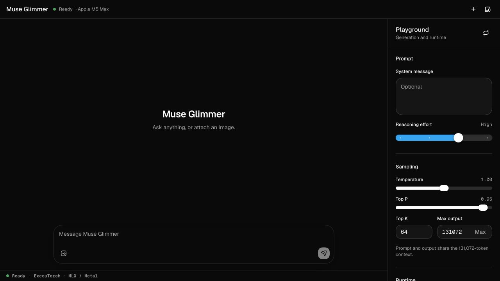

# Muse Glimmer Playground

A local Muse Glimmer 30B vision-and-reasoning chat app tuned for a 128 GB Apple M5 Max. Inference runs through ExecuTorch, MLX/Metal, and DFlash on this Mac; the server listens only on `127.0.0.1`, and conversations are not persisted to disk.



## Quick start

Requirements:

- An Apple silicon Mac. This preset is sized for a high-memory M5 Max; other Macs are not tested.
- Xcode, Node.js 20.19+ or 22.12+, npm, an internet connection, and at least 30 GB of free disk space.

Download and unzip the repository, then run this from the project folder:

```bash
./setup.sh
```

Setup prepares a project-local Python environment, builds the pinned ExecuTorch MLX worker, downloads the approximately 21 GB model and vision data, builds the browser app, and creates **Muse Glimmer.command** locally. Downloads and completed build work are reused later.

After setup, double-click **Muse Glimmer.command** in Finder and keep its Terminal window open. The launcher starts the server at [http://127.0.0.1:3939](http://127.0.0.1:3939) and opens the app in the default browser. Press Control-C in that Terminal window to stop the server and release the model.

To preserve setup errors or launch without Finder, run:

```bash
./Muse\ Glimmer.command
```

## Playground

- Live answer streaming with Muse Glimmer's thinking shown separately in an automatic collapsible disclosure
- Text and vision chat; attach one PNG or JPEG of up to 20 MB per conversation
- Edit or copy any prompt or response, regenerate responses, and stop active generation
- Markdown, tables, task lists, code, and links in responses
- A four-stop reasoning-effort slider for Low, Medium, High, or XHigh
- Temperature, Top P, Top K, and maximum-output-token controls
- Light, system, and dark themes with desktop and mobile layouts
- Time to first token, duration, throughput, thinking/output/input token usage, context usage, and runtime details

The recommended defaults are temperature `1.0`, Top P `0.95`, Top K `64`, High reasoning effort, and the full 131,072-token output ceiling. Prompt and output share that context window: before generation, the server subtracts the rendered prompt and gives the model the exact remaining room. The **Max** shortcut restores the full ceiling. Editing an earlier turn replaces that point in the conversation and removes everything after it; editing a user prompt immediately regenerates its response.

Stop is cooperative. It interrupts active decoding at the next DFlash boundary, but cannot interrupt model loading, prompt prefill, or image encoding.

The transcript, attached image, system message, and generation settings live only in browser memory and are cleared by a reload. The theme and an opaque runtime session identifier are stored locally.

## HTTP API

The browser and API share `http://127.0.0.1:3939`.

| Method   | Path                              | Purpose                                                  |
| -------- | --------------------------------- | -------------------------------------------------------- |
| `GET`    | `/health`                         | Server health                                            |
| `GET`    | `/api/runtime`                    | Loaded model, backend, limits, and defaults              |
| `GET`    | `/v1/models`                      | OpenAI-style model list                                  |
| `POST`   | `/v1/chat/completions`            | OpenAI-compatible chat completion, streaming or buffered |
| `POST`   | `/api/cancel`                     | Cooperatively stop the active session's decode           |
| `POST`   | `/v1/sessions/{session_id}/reset` | Clear a named session while retaining its slot           |
| `DELETE` | `/v1/sessions/{session_id}`       | Close a named session and free its slot                  |

```bash
curl http://127.0.0.1:3939/v1/chat/completions \
  -H 'Content-Type: application/json' \
  -d '{
    "model": "muse-glimmer-30b",
    "messages": [{"role": "user", "content": "Explain DFlash in two sentences."}],
    "temperature": 1.0,
    "top_p": 0.95,
    "top_k": 64,
    "max_tokens": 128
  }'
```

The API's session, reasoning, cancellation, metrics, and streaming extensions are documented in [ARCHITECTURE.md](ARCHITECTURE.md#http-and-streaming-contract).

## Local files and reset

The model, native source and build, Python runtime, tools, and download caches live in the ignored `.runtime/` directory. Browser dependencies and compiled assets remain project-local in `node_modules/` and `build/`. No Python package is installed globally; the only system-level addition setup may install is Xcode's official Metal compiler component. The generated **Muse Glimmer.command** is ignored by Git and can be recreated at any time with `./setup.sh`.

To reclaim the model and native build or force a clean setup, stop the server and delete `.runtime/`. Delete `node_modules/` and `build/` as well for a completely clean browser build. The next launch recreates them.

## Project details

See [ARCHITECTURE.md](ARCHITECTURE.md) for component boundaries, request flow, model and runtime choices, session semantics, native patches, containment, failure behavior, security considerations, and tradeoffs.

Runtime and model revisions are pinned in `scripts/runtime-config.sh`. Muse Glimmer's ExecuTorch support originated in [PR #21711](https://github.com/pytorch/executorch/pull/21711); the project uses the official [ExecuTorch PTE repository](https://huggingface.co/meta-models/Muse-Glimmer-30B-ExecuTorch-PTE) and follows the pinned [upstream Muse Glimmer guide](https://github.com/pytorch/executorch/blob/52b176fd9d5d5252f5010e60f17adfea83e8433d/examples/models/muse-glimmer/README.md).

## Project scope

This repository is published as a source distribution for the local playground. It is provided as-is, without a support or maintenance commitment.

## License

Project code is available under the [ISC License](LICENSE). See [Third-party notices](THIRD-PARTY-NOTICES.md) for the ExecuTorch patch attribution and the separate license and usage policy governing downloaded Muse Glimmer model files.
